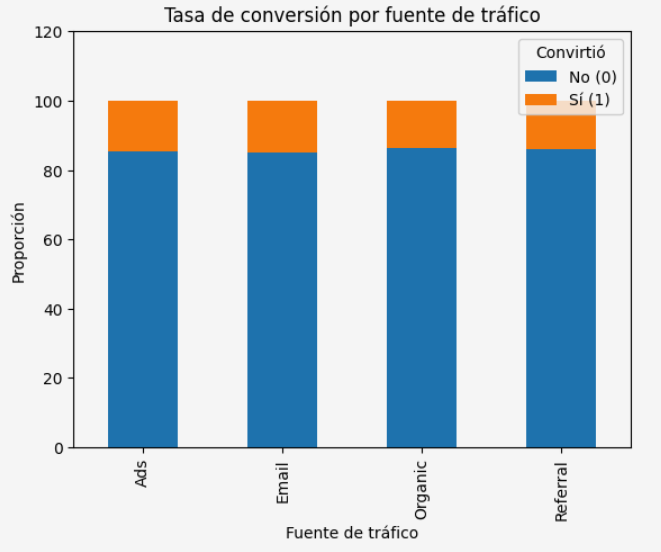

# A/B Testing – Landing Page Experiment

Este repositorio contiene el análisis realizado durante el Sprint 9, un experimento A/B sobre una página de inicio (landing page) para apoyar una decisión de negocio basada en datos.

## 📑 Tabla de contenidos

- [Descripción](#-descripción)
- [Tech stack](#-tech-stack)
- [Estructura del repositorio](#-estructura-del-repositorio)
- [Diccionario de datos](#-diccionario-de-datos)
- [Cómo reproducir el análisis](#-cómo-reproducir-el-análisis)
- [Objetivo del análisis](#-objetivo-del-análisis)
- [Resultados clave](#-resultados-clave)
- [Limitaciones](#-limitaciones)
- [Próximos pasos](#-próximos-pasos)
- [Licencia](#-licencia)

## 📋 Descripción

El objetivo de este proyecto fue evaluar un experimento A/B realizado en una página de inicio con versiones **A** y **B**, para determinar cuál genera mayor valor económico y una mejor tasa de conversión, y así recomendar qué versión adoptar.

Se utilizó el dataset `landing_experiment.csv`, con información de usuarios expuestos a las dos versiones de la página dentro del experimento: región, dispositivo, fuente de tráfico, tipo de usuario, conversión y gasto. El dataset no presenta valores nulos ni errores de formato relevantes en las variables categóricas.

## 🛠 Tech stack

- **Python** — pandas, numpy
- **scipy.stats** — pruebas de hipótesis (T de Student/Welch, Z de dos proporciones, Chi-cuadrado)
- **matplotlib / seaborn** — visualización de resultados
- **Jupyter Notebook**

## 📊 Diccionario de datos

| Columna | Descripción |
|---|---|
| `user_id` | Identificador único del usuario |
| `date` | Fecha en la que el usuario fue expuesto a la página |
| `landing` | Versión de la página mostrada al usuario (A o B) |
| `region` | Región geográfica del usuario |
| `dispositivo` | Tipo de dispositivo utilizado por el usuario |
| `traffic_source` | Canal por el que llegó el usuario |
| `user_type` | Tipo de usuario según historial previo (nuevo/recurrente) |
| `converted` | Indica si el usuario realizó una conversión (0/1) |
| `gasto` | Monto gastado por el usuario (0 si no convirtió) |

## ▶ Cómo reproducir el análisis

1. Abre `notebooks/S9_Version_Student_Proyecto_Landing_Experiment.ipynb`
2. Ejecuta las celdas en orden
3. El notebook carga automáticamente el dataset desde `data/raw/landing_experiment.csv`

## 🧠 Objetivo del análisis

- Explorar y validar la calidad de los datos (nulos, duplicados en `user_id`, formato de `date`, categorías esperadas)
- Comparar el **gasto promedio** por usuario convertido entre la página A y B (prueba T de Welch)
- Comparar la **tasa de conversión** entre la página A y B (prueba Z de dos proporciones)
- Evaluar la relación entre **fuente de tráfico** y conversión (Chi-cuadrado)
- Evaluar la relación entre **tipo de usuario** y conversión (Chi-cuadrado)
- Visualizar los resultados para respaldar las conclusiones con gráficos
- Traducir los hallazgos estadísticos en una recomendación de negocio

## 🔑 Resultados clave

- **Gasto promedio:** existe diferencia estadísticamente significativa entre los grupos (prueba T de Welch, p < 0.05); la página B muestra un gasto promedio ~12.5% mayor que la página A entre usuarios convertidos.
- **Tasa de conversión:** existe diferencia estadísticamente significativa entre los grupos (prueba Z de dos proporciones, p < 0.05); las tasas fueron 12.5% (A) vs. 16% (B), una diferencia de ~3.5 puntos porcentuales.

- **Fuente de tráfico vs. conversión:** existe una asociación estadísticamente significativa (Chi-cuadrado, p < 0.05), aunque las diferencias entre tasas de conversión por canal son pequeñas (todas por debajo del 20%), por lo que no se sugiere reenfocar la inversión de marketing hacia un canal específico.
- **Tipo de usuario vs. conversión:** no existe evidencia estadística de asociación (Chi-cuadrado, p > 0.05); el tipo de usuario no debería usarse como criterio de segmentación para esta estrategia.
- **Recomendación de negocio:** adoptar la página B como versión definitiva del sitio, dado el incremento tanto en gasto promedio como en tasa de conversión.

## ⚠️ Limitaciones

- El análisis es correlacional dentro del marco del experimento A/B; las conclusiones son válidas para el periodo y las condiciones en que se recolectaron los datos.
- Las diferencias en fuente de tráfico, si bien estadísticamente significativas, son pequeñas en magnitud y deben interpretarse con cautela antes de traducirlas en decisiones de inversión.

## 🚀 Próximos pasos

- Monitorear el desempeño de la página B tras su implementación completa para confirmar la mejora observada (validación post-lanzamiento)
- Explorar segmentaciones adicionales (región, dispositivo) para identificar oportunidades de optimización más específicas
